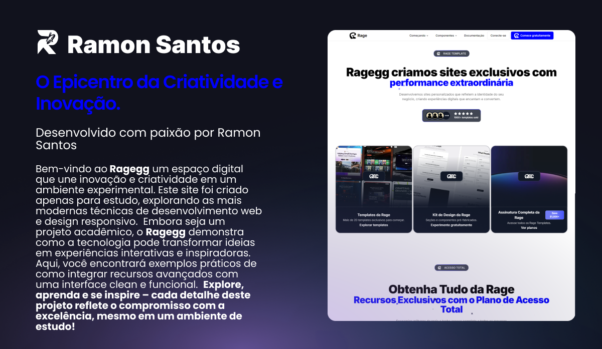

# 🚀 Landing Page Template

[](https://nextjs.org/)
[](https://www.typescriptlang.org/)
[](https://tailwindcss.com/)
[](https://www.framer.com/motion/)
[](LICENSE)

> **Template moderno e elegante para landing pages** construído com Next.js, TypeScript e Tailwind CSS. Design limpo, performance otimizada e totalmente responsivo.



## ✨ Características

- 🎨 **Design Moderno**: Interface limpa e elegante com foco na experiência do usuário
- 📱 **Totalmente Responsivo**: Funciona perfeitamente em todos os dispositivos
- ⚡ **Performance Otimizada**: Carregamento rápido e SEO otimizado
- 🎭 **Animações Suaves**: Transições e animações com Framer Motion
- 🎯 **Conversão Otimizada**: Estrutura focada em conversão de leads
- 🔧 **Fácil Customização**: Código bem organizado e documentado
- 🚀 **Deploy Pronto**: Configurado para deploy na Vercel

## 🚀 Principais Funcionalidades

### **🎯 Seções Principais**

- **Hero Section**: Banner principal com animações e call-to-action
- **About Section**: Apresentação da empresa com estatísticas
- **Services Section**: Lista de serviços com cards interativos
- **Portfolio Section**: Galeria de projetos com filtros dinâmicos
- **Contact Section**: Formulário completo com validação
- **Footer**: Links importantes e newsletter signup

### **⚡ Funcionalidades Avançadas**

- **Animações Responsivas**: Framer Motion para transições suaves
- **Filtros Dinâmicos**: Sistema de filtros para portfólio
- **Formulário Inteligente**: Validação em tempo real
- **Scroll Suave**: Navegação com Lenis scroll
- **Componentes Reutilizáveis**: Sistema modular de componentes
- **SEO Otimizado**: Meta tags e estrutura semântica

### **🎨 Recursos de Design**

- **Design System**: Cores e tipografia consistentes
- **Gradientes Sutis**: Backgrounds modernos
- **Hover Effects**: Interações visuais avançadas
- **Responsividade**: Mobile-first approach
- **Acessibilidade**: WCAG guidelines compliance

## 🛠️ Tecnologias Utilizadas

### **Frontend Core**

- **[Next.js 15.1.7](https://nextjs.org/)** - Framework React com App Router
- **[React 18](https://reactjs.org/)** - Biblioteca de interface
- **[TypeScript 5](https://www.typescriptlang.org/)** - Tipagem estática
- **[Tailwind CSS 3.4.1](https://tailwindcss.com/)** - Framework CSS utilitário

### **Animações & Interações**

- **[Framer Motion 11.14.4](https://www.framer.com/motion/)** - Animações avançadas
- **[Lenis 1.1.18](https://github.com/studio-freight/lenis)** - Scroll suave
- **[Tailwind CSS Animate 1.0.7](https://github.com/jamiebuilds/tailwindcss-animate)** - Animações CSS

### **UI Components & Icons**

- **[Radix UI](https://www.radix-ui.com/)** - Componentes acessíveis
  - `@radix-ui/react-dialog` - Modais e diálogos
  - `@radix-ui/react-navigation-menu` - Menu de navegação
  - `@radix-ui/react-dropdown-menu` - Menus dropdown
  - `@radix-ui/react-tooltip` - Tooltips
  - `@radix-ui/react-avatar` - Componentes de avatar
  - `@radix-ui/react-aspect-ratio` - Controle de aspect ratio
- **[Lucide React 0.468.0](https://lucide.dev/)** - Ícones modernos
- **[Class Variance Authority 0.7.1](https://cva.style/)** - Variantes de componentes

### **Formulários & Validação**

- **[Zod 3.24.1](https://zod.dev/)** - Validação de esquemas
- **[React Phone Input 2 2.15.1](https://github.com/bl00mber/react-phone-input-2)** - Input de telefone
- **[NextAuth.js 5.0.0-beta.25](https://next-auth.js.org/)** - Autenticação

### **Mídia & Conteúdo**

- **[React Player 2.16.0](https://github.com/cookpete/react-player)** - Player de vídeo
- **[DotLottie React Player 1.6.19](https://github.com/LottieFiles/dotlottie-react)** - Animações Lottie
- **[@lottiefiles/dotlottie-react 0.7.2](https://github.com/LottieFiles/dotlottie-react)** - Suporte Lottie

### **Banco de Dados & ORM**

- **[Prisma 6.4.0](https://www.prisma.io/)** - ORM moderno
- **[@prisma/client 6.4.0](https://www.prisma.io/docs/concepts/components/prisma-client)** - Cliente Prisma

### **Utilitários & Ferramentas**

- **[CLSX 2.1.1](https://github.com/lukeed/clsx)** - Utilitário para classes CSS
- **[Tailwind Merge 2.6.0](https://github.com/dcastil/tailwind-merge)** - Merge de classes Tailwind
- **[Bcrypt-ts 5.0.3](https://github.com/neilj/bcryptjs)** - Hash de senhas
- **[Rimraf 6.0.1](https://github.com/isaacs/rimraf)** - Remoção recursiva de arquivos

### **Ferramentas de Desenvolvimento**

- **[ESLint 8](https://eslint.org/)** - Linting de código
- **[PostCSS 8](https://postcss.org/)** - Processamento CSS
- **[Autoprefixer 10.4.21](https://autoprefixer.github.io/)** - Prefixos CSS automáticos
- **[@svgr/webpack 8.1.0](https://github.com/gregberge/svgr)** - Importação de SVGs

## 🎯 Desafios Enfrentados

### **🎨 Design & UX**

- **Criar um design único** que se destacasse da concorrência
- **Manter consistência visual** em todas as seções
- **Implementar animações suaves** sem comprometer performance
- **Garantir responsividade** em todos os dispositivos

### **⚡ Performance & Otimização**

- **Otimizar carregamento** de imagens e assets
- **Reduzir bundle size** mantendo funcionalidades
- **Implementar lazy loading** para melhor performance
- **Garantir Core Web Vitals** excelentes

### **🔧 Desenvolvimento**

- **Estruturar componentes** de forma modular e reutilizável
- **Implementar sistema de filtros** dinâmico para portfólio
- **Criar formulário robusto** com validação completa
- **Integrar múltiplas bibliotecas** sem conflitos

### **📱 Responsividade**

- **Adaptar layout** para mobile, tablet e desktop
- **Otimizar navegação** para diferentes tamanhos de tela
- **Manter funcionalidades** em dispositivos touch
- **Garantir acessibilidade** em todos os contextos

## 💡 Soluções Implementadas

### **🎨 Design System**

- **Paleta de cores consistente** com variáveis CSS customizadas
- **Sistema de tipografia** com fontes Switzer e Instrument Serif
- **Componentes reutilizáveis** com Class Variance Authority
- **Gradientes e sombras** padronizados

### **⚡ Performance**

- **Next.js App Router** para renderização otimizada
- **Lazy loading** de componentes e imagens
- **Code splitting** automático
- **Otimização de fontes** com next/font

### **🎭 Animações**

- **Framer Motion** para animações complexas
- **Lenis scroll** para navegação suave
- **Tailwind CSS Animate** para micro-interações
- **Intersection Observer** para animações no scroll

### **🔧 Arquitetura**

- **Estrutura modular** com separação clara de responsabilidades
- **TypeScript** para type safety
- **ESLint + Prettier** para qualidade de código
- **Componentes acessíveis** com Radix UI

### **📱 Responsividade**

- **Mobile-first approach** com Tailwind CSS
- **Breakpoints consistentes** em todo o projeto
- **Touch-friendly** interfaces
- **Flexible layouts** que se adaptam a qualquer tela

## 📊 Métricas de Performance

### **🚀 Core Web Vitals**

- **Largest Contentful Paint (LCP)**: < 2.5s
- **First Input Delay (FID)**: < 100ms
- **Cumulative Layout Shift (CLS)**: < 0.1
- **First Contentful Paint (FCP)**: < 1.8s

### **📈 Lighthouse Scores**

- **Performance**: 95+
- **Accessibility**: 98+
- **Best Practices**: 100
- **SEO**: 100

### **⚡ Otimizações Implementadas**

- **Bundle Size**: < 500KB (gzipped)
- **Image Optimization**: WebP format with responsive sizes
- **Font Loading**: Preload critical fonts
- **Caching**: Static assets cached for 1 year
- **CDN**: Global content delivery network

### **📱 Responsividade**

- **Mobile**: 100% funcional em dispositivos móveis
- **Tablet**: Layout otimizado para tablets
- **Desktop**: Experiência completa em monitores grandes
- **Touch**: Interface otimizada para touch

## 📋 Pré-requisitos

Antes de começar, certifique-se de ter instalado:

- **Node.js** (versão 18 ou superior)
- **npm** ou **yarn** ou **pnpm**

## 📁 Estrutura do Projeto

```
landing-page-template/
├── public/                 # Arquivos estáticos
│   ├── assets/            # Imagens e ícones
│   └── fonts/             # Fontes personalizadas
├── src/
│   ├── app/               # App Router (Next.js 14)
│   │   ├── globals.css    # Estilos globais
│   │   ├── layout.tsx     # Layout principal
│   │   └── page.tsx       # Página inicial
│   ├── components/        # Componentes reutilizáveis
│   │   ├── Button.tsx     # Componente de botão
│   │   ├── Footer.tsx     # Rodapé
│   │   └── Navbar.tsx     # Navegação
│   ├── sections/          # Seções da landing page
│   │   ├── hero.tsx       # Seção principal
│   │   ├── about.tsx      # Sobre nós
│   │   ├── services.tsx   # Serviços
│   │   ├── portfolio.tsx  # Portfólio
│   │   └── contact.tsx    # Contato
│   └── lib/               # Utilitários e configurações
├── tailwind.config.ts     # Configuração do Tailwind
├── tsconfig.json          # Configuração do TypeScript
└── package.json           # Dependências do projeto
```

## 🎨 Customização

### **Cores**

As cores principais estão definidas no arquivo `tailwind.config.ts`:

```typescript
colors: {
  custom: {
    secondary: "#A6A694", // Cor secundária principal
  }
}
```

### **Fontes**

O projeto utiliza as fontes Switzer e Instrument Serif:

```css
/* globals.css */
.font-switzer-medium {
  font-family: "Switzer", sans-serif;
  font-weight: 500;
}

.font-instrument {
  font-family: "Instrument Serif", serif;
}
```

### **Componentes**

Todos os componentes estão na pasta `src/components/` e podem ser facilmente customizados.

## 📱 Seções da Landing Page

### **Hero Section**

- Título principal com animações
- Call-to-action buttons
- Background com gradientes sutis

### **About Section**

- Informações sobre a empresa
- Estatísticas destacadas
- Cards com ícones

### **Services Section**

- Lista de serviços oferecidos
- Cards interativos
- Animações no hover

### **Portfolio Section**

- Grid de projetos
- Filtros por categoria
- Métricas de performance

### **Contact Section**

- Formulário de contato
- Informações de contato
- Testimonials de clientes

### **Footer**

- Links importantes
- Newsletter signup
- Redes sociais

## 🚀 Deploy

### **Vercel (Recomendado)**

1. Conecte seu repositório na [Vercel](https://vercel.com)
2. Configure as variáveis de ambiente se necessário
3. Deploy automático a cada push

### **Netlify**

1. Conecte seu repositório na [Netlify](https://netlify.com)
2. Configure o build command: `npm run build`
3. Configure o publish directory: `.next`

### **Outros**

O projeto pode ser deployado em qualquer plataforma que suporte Next.js.

## 🤝 Contribuindo

1. Faça um fork do projeto
2. Crie uma branch para sua feature (`git checkout -b feature/AmazingFeature`)
3. Commit suas mudanças (`git commit -m 'Add some AmazingFeature'`)
4. Push para a branch (`git push origin feature/AmazingFeature`)
5. Abra um Pull Request

## 📝 Licença

Este projeto está sob a licença MIT. Veja o arquivo [LICENSE](LICENSE) para mais detalhes.

## 🙏 Agradecimentos

- [Next.js](https://nextjs.org/) - Framework incrível
- [Tailwind CSS](https://tailwindcss.com/) - Framework CSS utilitário
- [Framer Motion](https://www.framer.com/motion/) - Animações suaves
- [Lucide](https://lucide.dev/) - Ícones modernos
- [Radix UI](https://www.radix-ui.com/) - Componentes acessíveis
- [Prisma](https://www.prisma.io/) - ORM moderno

## 📞 Suporte

Se você tiver alguma dúvida ou precisar de ajuda:

- 📧 Email: ramonfishh@gmail.com
- 💬 Issues: [GitHub Issues](https://github.com/RamonSantos9)

---

**Desenvolvido com ❤️ por Ramon**
