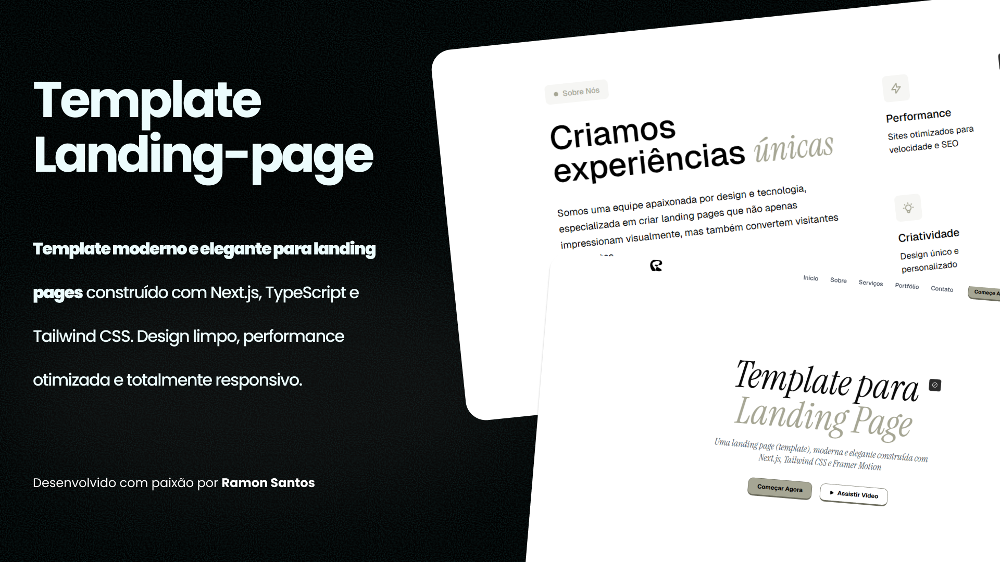

# Rage-Template



Rage-Template é um template moderno e flexível, desenvolvido com foco em performance e escalabilidade. Ideal para projetos de estudo e experimentação, ele utiliza as mais modernas tecnologias do ecossistema web.

## Descrição

O Rage-Template foi criado para facilitar a construção de interfaces modernas e responsivas. Com uma estrutura modular e escalável, este template serve como base sólida para quem deseja experimentar e aprender novas abordagens no desenvolvimento web.

## Demonstração

Confira a demonstração ao vivo: [rage-template.vercel.app](https://rage-template.vercel.app)

## Tecnologias Utilizadas

- **TypeScript:** Linguagem principal para desenvolvimento, garantindo tipagem estática e robustez ao código.
- **CSS:** Utilizado para estilização e customização visual do template.
- **JavaScript:** Complementa funcionalidades específicas do projeto.
- **Next.js:** Framework React com renderização do lado do servidor, ideal para performance e escalabilidade.
- **Tailwind CSS:** Framework CSS para estilização rápida e eficiente.

## Funcionalidades

- Estrutura modular e escalável para facilitar a manutenção.
- Componentização simplificada para desenvolvimento ágil.
- Configuração pronta para desenvolvimento com Next.js.
- Integração com Tailwind CSS para estilos customizados e responsivos.
- Configuração de ESLint para padronização e qualidade do código.

## Instalação

Para rodar o projeto localmente, siga os passos abaixo:

1. **Clone o repositório:**
   ```bash
   git clone https://github.com/RamonSantos9/Rage-Template.git
   ```
